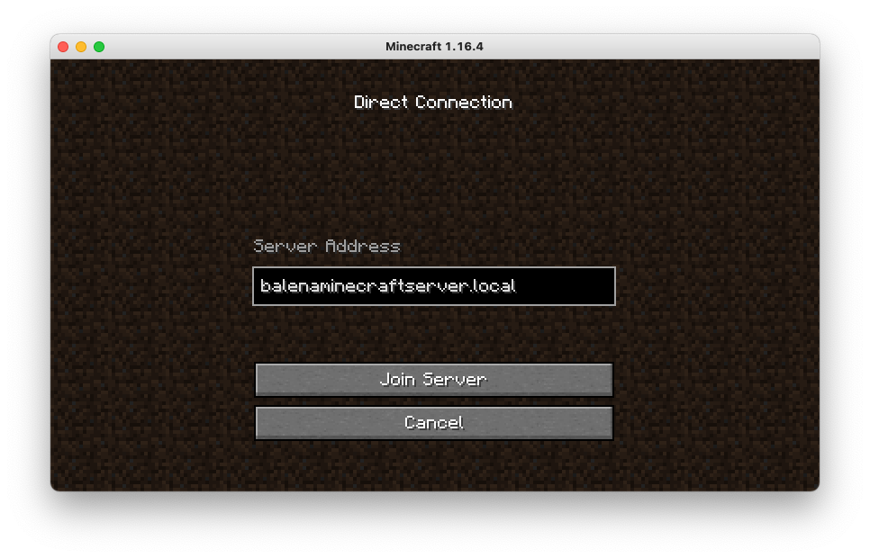
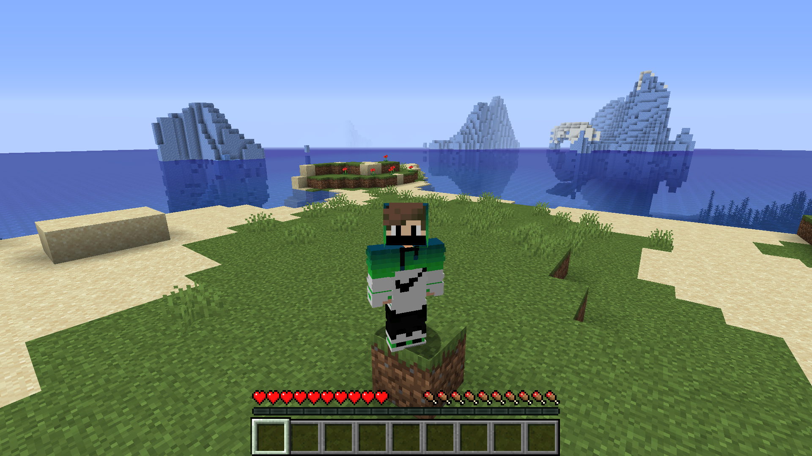
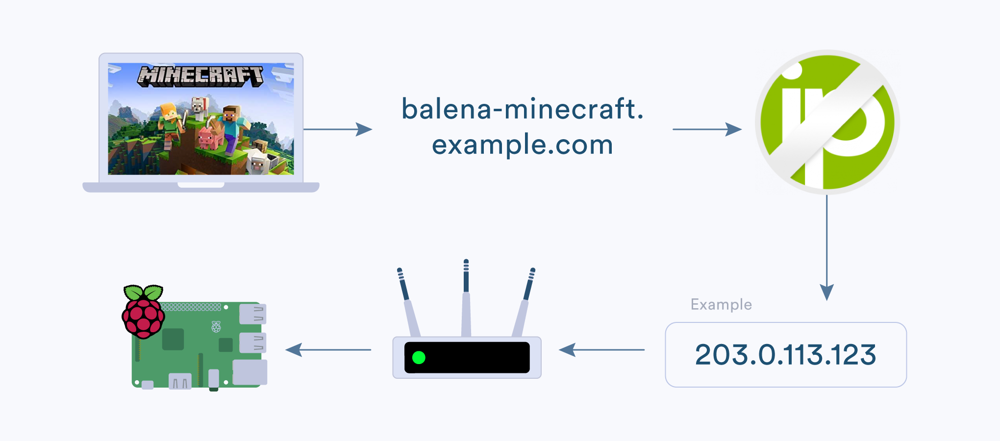

# RLCraft Forge Modpack Minecraft Server
**Starter project enabling you a Minecraft Server using just a Raspberry Pi 4.**

This project has been tested on a Raspberry Pi 4 B 4GB. I do not recommend using a Raspberry Pi 3 or older. They have not enough RAM and power to calculate all the things. :boom:

> The [original project](https://github.com/AlexProgrammerDE/balena-minecraft-server) helps you create a vanilla minecraft server of the latest version. This project is modified for the [RLCraft Modpack](https://www.curseforge.com/minecraft/modpacks/rlcraft), which runs on version 1.12.2.  
> If you want to run your own server using this project as a starting point, then I do recommend you to go to the RLCraft page and read the instructions there. You should also download the serverpack and read the "FOR SERVERS ONLY..." file. Most of the stuff will be taken care of automatically, but it helps to be aware of whats going on, in case something does go wrong.  

## Why balenaMinecraftServer?

* It works out of the box, just start it and it just works. :+1:
* It is free. No costs, no big server and no complication. :free:
* Why host on a computer? A Pi is power efficient! :rocket:
* You can easy maintain the files on the Pi by using your PC. :computer:

## Hardware required

* Raspberry Pi 4B (We recommend the 4GB or the 8GB model. 1GB is not enough!)
* A fan or cooling system to prevent lag caused by throttling
* A 16GB or greater micro SD Card (We always recommend SanDisk Extreme Pro SD cards)
* Power supply

## Software required

* A download of this project (of course)
* Software to flash an SD card ([balenaEtcher](https://balena.io/etcher))
* A free [balenaCloud](https://balena.io/cloud) account
* The [balena CLI tools](https://github.com/balena-io/balena-cli/blob/master/INSTALL.md)

## Setup and use :stars:

To run this project is as simple as deploying it to a balenaCloud application; no additional configuration is required.

### Setup the device :cd:

* Sign up for or login to the [balenaCloud dashboard](https://dashboard.balena-cloud.com)
* Create an application, selecting the correct device type for your Raspberry Pi
* Add a device to the application, enabling you to download the OS (production)
* Flash the downloaded OS to your SD card with [balenaEtcher](https://balena.io/etcher)
* Power up the board and check it's online in the dashboard

### One Click Deployment

You can deploy this server with one click with the button below. Or, you can follow the manual deployment instructions in the next section.

### Manually Deploy this application :airplane:

* Install the [balena CLI tools](https://github.com/balena-io/balena-cli/blob/master/INSTALL.md)
* Login with `balena login`
* Download this project and from the project directory run `balena push <appName>` where `<appName>` is the name you gave your balenaCloud application in the first step.

## Connect to the server :satellite:

Balena Minecraft Server sets automatically your Server hostname to `balenaminecraftserver.local`. It is the address the from your server. You can connect to it like this:

**NOTE:** The IP address also works.  
**NOTE:** If this doesn't work, then try adding `:25565` at the end, and try removing the `.local`

Now you have a balenaServer :sunglasses::

**NOTE:** This works only in the local network. If you want to play worldwide [click here](https://github.com/flpeters/balena-minecraft-server#play-worldwide-optional-earth_americas).

## Connect to the terminal :satellite:

The server has no console input option in the cloud dashboard, so you need `RCON`. The port is `25575` and the password is `balena`. It is a protocol for connecting to the server.  
There are many clients, but you can pick one here:

* mcrcon: https://github.com/Tiiffi/mcrcon/releases (NOTE: For starting this script you will need this batch file if you are using windows (Just paste it in the unzipped directory.): https://github.com/AlexProgrammerDE/RCON-Script/blob/master/launch.bat)

* Minecraft Server RCON: https://alexprogrammerde.github.io/Minecraft-Server-RCON.rar

**NOTE:** The password can be changed in the `server.properties` file which can be accessed via SCP (see below).

## Connect to the file-directory :satellite:

You can connect to the server and change your serverfiles. I recommend using a tool like [WinSCP](https://winscp.net/) or if you are using OSX or a linux distribution you can use [Filezilla](https://filezilla-project.org/).  The IP Address to connect to is “balenaminecraftserver” (without the quotes), the protocol to choose is SCP (If you got the choice), the port number is 22, the username is “root” (again, without the quotes) and the password is “balena” (no quotes). The files are in the folder named “serverfiles” at the root directory, you can double click to open that directory and browse the files in there.

**NOTE:** You can also change your SCP password by setting the `SCP_PASSWORD` Environment Variable within balenaCloud.  On the left, simply click on “Device Variables” and then click the “Add Variable” button. Give it a name of `SCP_PASSWORD`, and set the value to your password. 

## Change hostname
You can change the hostname by defining the `DEVICE_HOSTNAME` Environment Variable within balenaCloud.

**NOTE:** If you decide to change the hostname, you will have to use your new hostname within Minecraft to connect to the server, instead of `balenaminecraftserver.local`.

## Custom RAM (optional) :link:

Devices like the Raspberry Pi 4B 4GB or the 8GB model have enough RAM to run the server with more RAM (the default value used by balena Minecraft server is 3.4GB). If you set `RAM` to a value like `2G`, `3400M`, `4G`, `5500M`,  or `6G` it will have the specified amount of RAM available.

## Custom JVM (Java) parameters (optional) :link:

For optimizing the server performance it can be usefull to change the way java runs. The [defaults provided](https://aikar.co/2018/07/02/tuning-the-jvm-g1gc-garbage-collector-flags-for-minecraft/) are well regarded, but if you want to change them, then you can set `JVM_FLAGS` to anything you like.

## Pregenerate the world (recommended) 🗺️

The Pi has limited processing power and memory, and world generation is among the most demanding tasks that your server has to do. Luckily for us, this step can be done in advance, instead of on demand as players move to new areas.
1. Download the most recent version of [the Chunk-Pregenerator mod](https://www.curseforge.com/minecraft/mc-mods/chunkpregenerator) for Game Version `1.12.2`, since this is the version that RLCraft runs on.
2. Connect to your Pi via SCP (see above), and place the downloaded jar file in the mods folder. Restart your Pi via the balena dashboard to load the mod.
3. Connect to the server via RCON (see above), and run these commands:
    - `/pregen utils setPriority pregenerator`
    - `/pregen timepertick 250`
    - `/pregen gen startradius square 0 0 b10000`
4. The `b10000` at the end of the last command is the number of blocks to generate in each direction. 10000 is the recommended setting by the modpack author. Actually generating all of that on a laptop (which is a lot more powerful than a Pi4) took me over two days however, and over 10GB of storage space. Generating 1000 blocks in each direction on a Pi4 took 20 minutes. In general, doubling the number leads to approximately four times the necessary work (so quadrupling = 16 time the work). On the other hand, halving the number also decreases the work to one fourth, so choose wisely.
5. If you run out of memory, using `/pregen gen startmassradius square 0 0 b10000 100` instead as the third command might help.
6. Pregeneration will continue even if the server restarts (rerun the first command in that case to speed up generation), but if you want to cancel the task early, use `/pregen clear` (check out the mods documentation for more info).
7. Once finished, restart your server by sending the `stop` command via RCON. It will automatically restart. You might also want to remove the mod, but it's not necessary.

**NOTE:** You can also use an already existing map, by simply replacing the world folder. This means you can pregenerate the world on a more powerful machine, and then use that world on the Pi server. Be careful however with using maps generated for different minecraft versions or different mods. Those may not work in the way you intended.

## Play worldwide (optional) :earth_americas:

Once you’ve perfected the setup of your server on your local network, you might be interested in unveiling your server to the rest of the world! Here’s how you can enable remote access and allow players to connect via the Internet.

If you’d like to allow friends outside of your local network to join your server, you’ll need to set up dynamic DNS (DDNS) to expose your Pi to the outside world. This example uses a service called No-IP, which has a free tier for people who want to try DDNS out, though other options and methods do exist as well. In the case of this example, you will need to: 

* Create an account with [No-IP](https://www.noip.com/sign-up) by visiting their website.
* After creating the account and logging in, create a Hostname (example: balena.serverminecraft.net) by [following their documentation](https://www.noip.com/support/knowledgebase/getting-started-with-no-ip-com/).
* Set up Port Forwarding: You will need to route your Minecraft traffic to port 25565 on your Pi. To do this, you will log in to your home router and setup Port Forwarding. This step varies by particular brand of modem or router, but the No-IP documentation does a good job of describing the process [here](https://www.noip.com/support/knowledgebase/general-port-forwarding-guide/). You may need to follow instructions specific to your modem or router if the No-IP documentation does not contain your particular type.
* Optional: You can login to No-IP with your router to keep the IP Address current in case it changes. That allows the router to connect automatically to No-IP. Here is a [guide by No-IP](https://www.noip.com/support/knowledgebase/how-to-configure-ddns-in-router/) on how to accomplish this.
* Paste your public / external internet address in the box labeled IP Address into the No-IP dashboard. You're done. 👍

For a deeper look at setting up remote access, please [reference this guide](https://www.noip.com/support/knowledgebase/getting-started-with-no-ip-com/) (Note: You can skip the DUC part).

## Playing a different Modpack (optional) 🔧

Switching to a different modpack takes a bit of work, but can be done.  
There are two things you need for every modpack out there:  
- The modpack itself, meaning all the mods and configurations,
- and a minecraft server file compatible with those mods.  

Since every modpack packages their files a little bit differently, there is no one size fits all solution.  
Sometimes the modpack includes the server, and sometimes you need to download it from somewhere else. Sometimes a install script is included, and sometimes you need to run everything yourself. I can't exactly guide you through every combination, I wont. Instead I'll just point you in the right direction, and you'll figure out the rest.  

---
- All the setting up of the server is done in the `./mc-server/start.sh` file, so that's what you'll need to modify to suit your needs. If you want different default server settings, then you might also want to modify the files in `mc-server/serverfiles/`.  
- Modpacks can be found at https://www.curseforge.com/minecraft/modpacks.
  - Find the serverpack for the modpack you want to install,
  - press `F12` to open up your web browsers developer tools, and navigate to the network tab.
  - Click the download button and wait until your download starts.
  - There should now be a connection to `media.forgecdn.net` listed in the network tab. This is the address you need, to download the modpack via command line / in `start.sh`. Copy the URL, and make sure it looks something like this: `https://media.forgecdn.net/files/2935/323/RLCraft+Server+Pack+1.12.2+-+Beta+v2.8.2.zip`.
  - The modpack needs to be unzipped, and the contents need to be in the same folder as the forge server.
  - Before turning all of this into a script, make sure you understand how the modpack author expects you to install it. If a forge server is already bundled with the modpack, then you don't need to download and install one.
- The forge server is downloaded from https://files.minecraftforge.net/.
  - Pick whatever minecraft version is required by your modpack on the left,
  - click "Show all Versions", then choose the most recent (or recommended by modpack) version of the server,
  - then hover your mouse on the `i` next to `installer`.
  - There you'll see the direct download link, and the hash sums for validating that you downloaded the correct file. The link should look like this: `https://files.minecraftforge.net/maven/net/minecraftforge/forge/1.12.2-14.23.5.2855/forge-1.12.2-14.23.5.2855-installer.jar`
  - The installer can be executed by double clicking it, or via the command line (like in `start.sh`). Use `java -jar forge-1.12.2-14.23.5.2855-installer.jar --help` for details on how to it, or just pass `--installServer` to it to install in the current directory.
- Take care how you write your script. `start.sh` will run every time the server restarts. Currently we creates a certain file in `./servercache/`, and then check every time `start.sh` is executed if that file already exists. If it does, we know we don't have to install stuff again and can just start the server. This is not foolproof however, so again, take some care.
- If you want to use the hash validation, make sure to copy the correct hash sums (we currently use MD5). If you don't want to validate, then you can also just delete that part of the code.
- To run the server we use the command `java -Xms$RAM -Xmx$RAM $JVM_FLAGS -jar $SERVER_JAR nogui`. `-Xms` and `-Xmx` are settings for how much ram the server is allowed to use, the `$RAM` is a variable that will be replaced with whatever we set `RAM` equal to previously. The `JVM_FLAGS` are taken from https://aikar.co/2018/07/02/tuning-the-jvm-g1gc-garbage-collector-flags-for-minecraft/, on recommendation of the RLCraft author.

## Vanilla Server (optional) :eyeglasses:

If you want the vanilla minecraft experience, take a look at the original project here on github: https://github.com/AlexProgrammerDE/balena-minecraft-server
